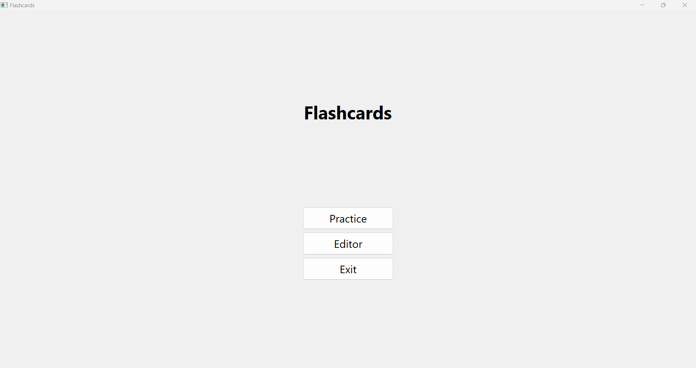
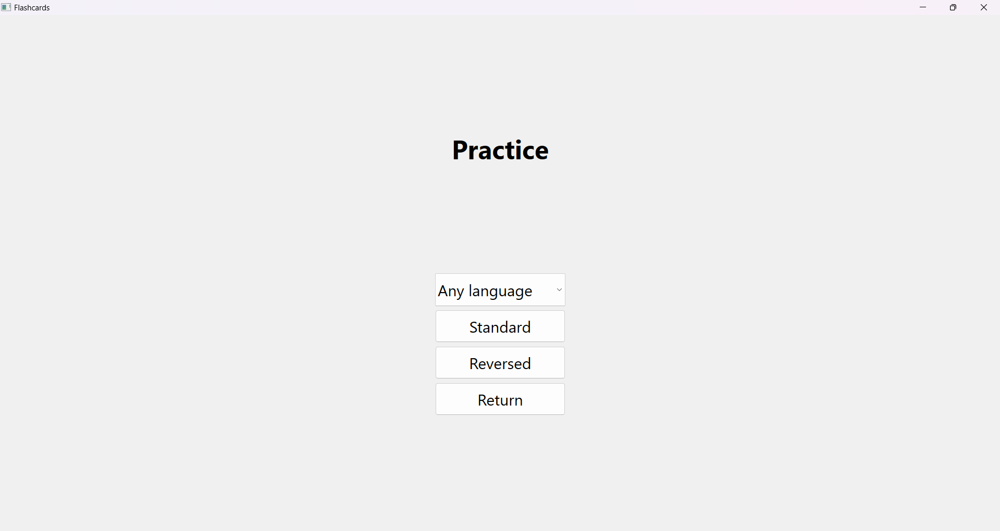
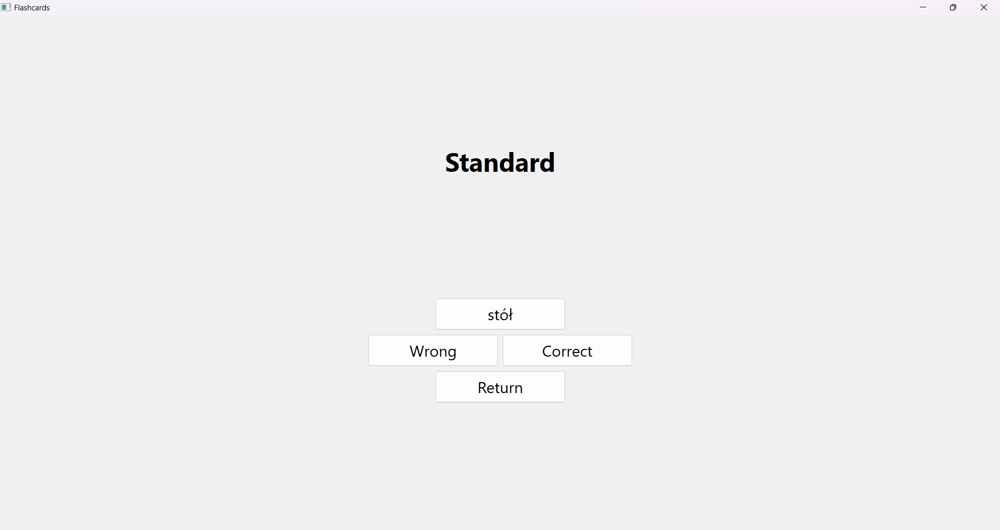
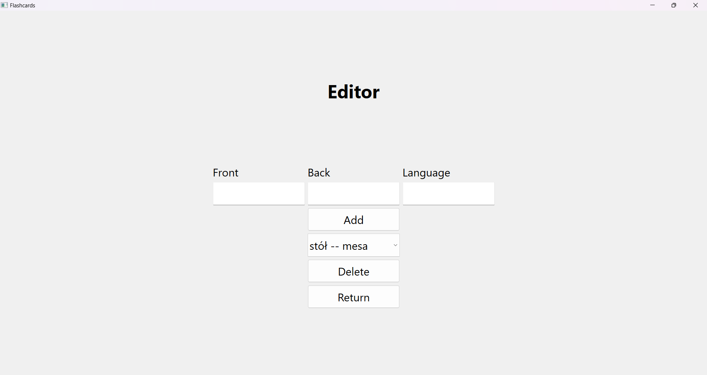

# Flashcards

An interactive C++ application with a graphical user interface (GUI) for learning, utilizing a spaced repetition system and powered by SQLite for efficient vocabulary memorization. This project is designed to offer users an effective tool for enhancing their language learning experience by leveraging the proven benefits of the spaced repetition technique.

## Project objective

The primary goal of the Flashcards application is to help users expand and reinforce their vocabulary knowledge in a foreign language. By leveraging the spaced repetition method, users can improve their memory retention of difficult words through timely reviews.

## Functionality

- **Dynamic Learning Sessions**: Adjusts the frequency of flashcard reviews based on user performance, ensuring that learners review material at the most effective intervals for memory retention.
- **Multiple Languages Support**: Allows users to create and practice flashcards in various languages, making it a versatile tool for language learners worldwide.
- **Interactive Learning Experience**: Provides users with a graphical user interface (GUI) to enhance the learning experience, making navigation and interaction straightforward and efficient.
- **Flexible Learning Modes**: Includes standard and reversed flashcard modes for versatile learning experiences.

## Technologies

- **C++**: For the core application logic and graphical user interface (GUI).
- **SQLite**: Utilized for storing and managing flashcards data.
- **Qt**: Used to create the interactive GUI for the application.
- **CMake**: Employed for building the project, ensuring portability across different platforms.
- **Qt Creator**: Recommended IDE for development and project management, with integrated support for Qt and CMake.

## Screenshots

Here are a few screenshots demonstrating the main features of the Flashcards application. These images provide a glimpse into the user interface and the interactive learning experience offered by the app.

### Main Menu

The main menu offers quick access to all the application's features, including starting a new learning session, reviewing your progress, and managing your flashcards.



### Language and Learning Mode Selection

Before starting your practice session, you'll select your preferred language and learning mode. This customization allows you to tailor the learning experience to your individual needs and goals.



### Standard Learning Mode

In the Standard Learning Mode, you are presented with flashcards one at a time. After reviewing the front of the card, you can reveal the back by clicking on it. Depending on your familiarity with the content, you can mark each card as "Correct" or "Wrong," which informs the spaced repetition algorithm for future sessions.



### Flashcard Management

Easily add or remove flashcards to tailor your learning experience to your personal needs or learning goals.



## Installation

Before running the application, ensure you have the following installed:

- [Git](https://git-scm.com/downloads) - for cloning the repository.
- [Qt Creator](https://www.qt.io/download) - Recommended IDE for project development, includes the Qt framework and Qt Designer for UI development.
- [CMake](https://cmake.org/download/) - for building the project.

### Optional
- [SQLite](https://www.sqlite.org/download.html) - While SQLite support is included with Qt, direct installation of SQLite might be useful for manual database manipulation or for using features outside of the Qt framework.
- [SQLiteStudio](https://sqlitestudio.pl/) - A user-friendly SQLite database management tool, helpful for visually creating, modifying, and managing SQLite databases.

### Setting Up

1. **Install Qt**:
Download and install Qt from the official Qt website. Make sure to include Qt Creator and the Qt Development Libraries in your installation.

2. **Install CMake**:
Download and install CMake from the official CMake website. Ensure it's added to your system's PATH.

3. **Clone the Repository**:

```bash
git clone https://github.com/JakubPaczek/flashcards.git
cd flashcards
```

4. **Build the Project**:
Inside the project directory, run:

```bash
mkdir build && cd build
cmake ..
cmake --build .
```

This will compile and link the application. The executable will be located in the build directory.

**Using Qt Creator**

Alternatively, you can open and build the project in Qt Creator, which provides a user-friendly interface for project management, code editing, and debugging.

- Launch Qt Creator and select Open Project from the File menu.
- Navigate to your project directory and select the CMakeLists.txt file, then click Open.
- Choose the appropriate build kit when prompted and click Configure Project.
- To build the project, click the Build button in the left toolbar or select Build Project from the Build menu.
- You can then run the application directly from Qt Creator by clicking the Run button.